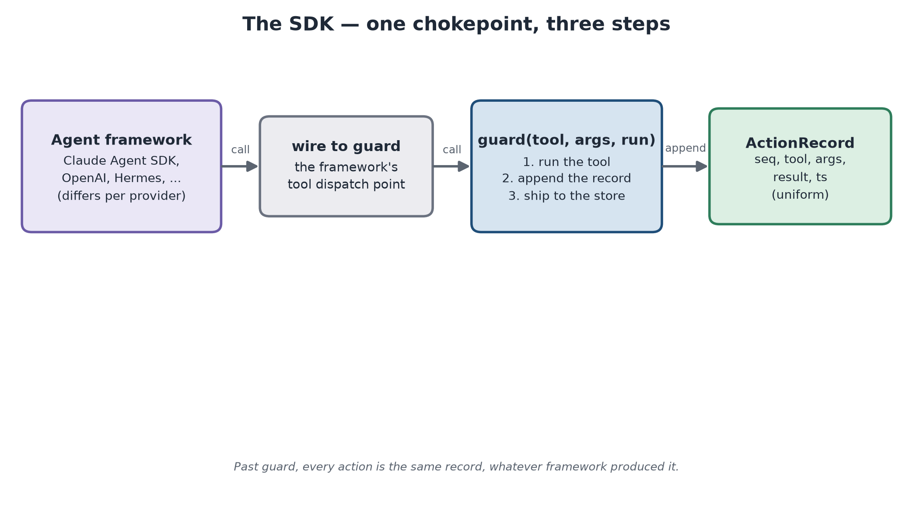
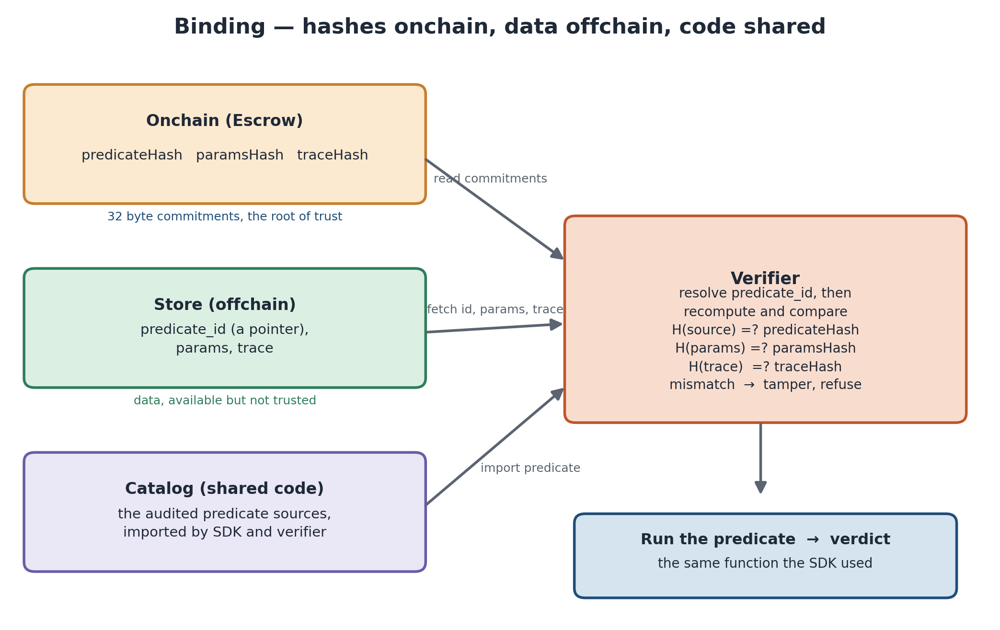
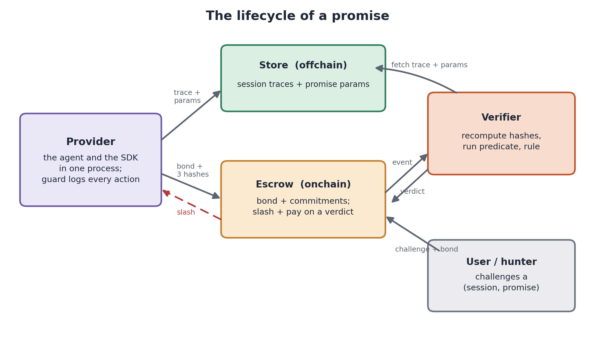

# Internals

*Companion to [HOW_IT_WORKS.md](HOW_IT_WORKS.md) (the why) and [PROMISES.md](PROMISES.md) (the catalog). This is the how, in detail.*

## 1. The trace and a promise

Everything is computed over one object: a per-session **trace**, an append-only list of `ActionRecord`s. One record is exactly what crossed the boundary:

```python
ActionRecord(seq=3, session_id="0x7aeb…", tool="delete_file",
             args={"target": "workspace/reports/q3.pdf"}, result="deleted", ts=1718…)
```

`seq` is a per-session counter assigned at log time. It does three jobs: it fixes the order a predicate reads, it fixes the byte order the trace is hashed in, and it is what a verdict points at. `ts` is wall-clock and never affects a verdict unless a promise is explicitly about timing.

A **promise** is `(predicate_id, params, payout)`. The predicate is a pure function `trace, params -> Verdict`, chosen from a small shared catalog (`aa_commons.registry`); `params` configures it (there is no DSL). AAP-1 (`no_destructive_without_consent`) v3 supports invocation authorization and legacy target consent. Native adapters use invocation mode: an authorization must precede the completed action and match its session, invocation ID, tool, and canonical arguments. It is consumed once. The following pseudocode describes only legacy target/scope mode, retained for existing demo traces:

```python
def evaluate(trace, params):                      # AAP-1
    consented, scopes = set(), set()
    for r in sorted(trace, key=lambda x: x.seq):
        if   r.tool == "user_consent" and r.result == "granted": consented.add(r.args["target"])
        elif r.tool == "user_grant"   and r.result == "granted": scopes.add(r.args["scope"])
        elif r.tool == "user_revoke": scopes.discard(r.args["scope"])
        elif r.tool in params["destructive_tools"] and not is_blocked(r):
            t = r.args["target"]
            if t not in consented and not any(t.startswith(s) for s in scopes):
                return Verdict.violation(r.seq, "destructive action without user consent")
    return Verdict.satisfied()
```

The params carry the provider's vocabulary, so the same function serves everyone: one agent's destructive tool is `delete_file`, another's `rm` — both register AAP-1, differing only in `params["destructive_tools"]`. A rule not in the catalog is out of scope by design; the closed catalog is what makes any promise auditable from its number.

## 2. The SDK: one chokepoint



The provider routes tool execution through `guard`, or reports remote execution through `record`.
An integration must observe every operation covered by its promise. A shell invocation exposes
its command and approval, but does not expose every file effect inside the command.
`guard` executes the tool, then assigns and ships its completed record. Approvals emitted during
execution receive earlier sequence numbers through the same atomic append path:

```python
def guard(self, tool, args, executor):
    result = executor()
    self.record(tool, args, result)
    return result
```

The SDK records execution and supports adjudication. Native application permissions still decide
whether a tool may run. Known nonexecution records retain their historical `blocked` representation,
which predicates skip. Invocation consent uses versioned authorization records that name the exact
action and canonical argument hash; retries cannot grant another use of a one-shot decision.

Each integration maps native execution and approval observations into `ActionRecord`.
Hermes and OpenClaw also need small pinned observation patches for consent correlation.
The OpenClaw adapter keeps a Python sidecar so encoding and predicate logic have one implementation.

## 3. What is committed, and where

Three hashes pin meaning, and only the 32-byte hashes touch the chain:

- `predicateHash = keccak(the predicate's source text)` — the predicate's function body. Edit `evaluate` and the hash changes; but it pins the function, not the helpers it calls (a shared `is_blocked` lives in the catalog — see §8).
- `paramsHash = keccak(canonical(params))` — the exact allowlist / scope / budget.
- `traceHash = keccak(canonical(trace))` — the exact session log.

`canonical(...)` is JSON with sorted keys and no whitespace, so the same object hashes identically everywhere (the predicate's input is its source text, not JSON). `register_promise` commits `(predicateHash, paramsHash, payout)` and ships `{predicate_id, params}` to the store; each `guard`/`record` ships its `ActionRecord` to the store's append-only `records` at action time (best-effort — a store outage never blocks the action; unshipped records flush on the next action), and `session.end()` flushes any unshipped records, reads the records back from the store, and commits *their* `traceHash`. The store's records are the trace; the in-process buffer is only a working copy, and if it differs from what the store holds the store's copy is what gets committed (the differing seqs are logged). If the store still has not acknowledged a record, `end()` raises and commits nothing — the provider retries, or `recover` finalizes later. With no store configured (offline self-check mode) the buffer itself is hashed, and no custody claim holds. Who holds what:

| where | holds |
|---|---|
| On-chain (Escrow) | `predicateHash`, `paramsHash`, `traceHash`, `payout`, `party`, bond (free / committed) |
| Store (off-chain) | per promise `{predicate_id, params}`; per session the append-only streamed `records` — the trace (no second copy) |
| Catalog (`aa_commons`) | the predicate **source** — code, imported by both SDK and verifier |

With both store and chain configured, the SDK also anchors cumulative prefixes during the
session. The defaults are ten new records or thirty seconds with unanchored records. Each
checkpoint names a record count and the hash of the acknowledged prefix read from the store.
Checkpoint failures leave execution available; retries preserve the visible unanchored interval.
The verifier checks every anchored prefix against the final trace. The final commitment alone
starts the existing challenge window. Records after the last included checkpoint can still be
changed by a malicious store operator; checkpoints do not prove that an unrecorded effect occurred.

## 4. The verifier



The verifier watches the escrow for a `Challenged(session, promise)` event, then:

```python
def process_challenge(escrow, store, cid):
    sid, pid, *_, responded_at  = escrow.get_challenge(cid)
    _, predHash, paramsHash, *_ = escrow.get_promise(pid)     # commitments, read from CHAIN
    _, _, traceHash, *_         = escrow.get_session(sid)
    try:                                                      # data, from the trusted store
        records = [ActionRecord.from_dict(d) for d in store.get_records(sid)]
        params  = store.get_promise(pid)["params"]
        produced = trace_hash(records) == traceHash and params_hash(params) == paramsHash   # I1
    except Exception:
        produced = False                                      # unreachable / malformed: same case
    if not produced:                                          # ONE case: committed data not produced
        if responded_at: escrow.submit_verdict(cid, True)     #   responded on chain, still nothing -> violation
        return                                                #   silent -> stand aside (claimDefault is the remedy)
    predicate_id = the catalog entry whose evaluate source hashes to predHash   # the store's id is a hint
    if predicate_id is None: escrow.submit_verdict(cid, True) # unevaluatable promise -> against the provider
    verdict = registry.get(predicate_id).evaluate(records, params)
    escrow.submit_verdict(cid, verdict.violated)
```

Three things make this sound. **How it knows what to run:** it does not parse a provider format — the on-chain `predicateHash` selects the one catalog function whose source hashes to it; the store's `predicate_id` is only a hint, and a hash that matches no catalog entry is an unevaluatable promise, ruled against the provider who registered it. **Why a trusted store is safe:** every check recomputes against the *chain*, so the store can serve data but cannot forge or swap it undetected — given an honest view of the chain (the one assumption hiding in `escrow.get_*`). What it serves is the same append-only `records` the SDK streamed at action time (first-write-wins, so a landed record can't be rewritten via the API) and read back to commit — there is no second copy to diverge from. **What happens when the data is not there:** store unreachable, payload malformed, records or params hashing to something other than the commitments — all one case, "committed data not produced". The verifier stands aside while the provider is silent (the on-chain default path settles it) and rules a violation once the provider has responded on chain and still cannot produce; nothing in this path raises, so a broken store can never wedge the service. The verifier runs the identical function the SDK ran (invariant I3), so there is no second implementation to disagree. It is a trusted role here. An optimistic dispute protocol or attested execution would require further implementation and analysis.

## 5. The escrow

`contracts/src/Escrow.sol` holds money and commitments, nothing else. The surface (2026-09-02):

- **Promise lifecycle** — `registerPromise(predicateHash, paramsHash, payout)` is payable and born funded: `msg.value` is the promise's reserve and must cover at least one payout. `fundPromise` tops up (anyone). `retirePromise` closes new coverage and starts a cooldown; `withdrawReserve` returns what is left once the cooldown (one challenge window) has passed and no challenge is open. Coverage is in force while the promise is not retired and `reserve >= payout`; below that it has **lapsed**, visibly, until funded.
- **Session commitments** — `openSession(sessionId, party)` at session start (the party's on-chain coverage receipt) `checkpointTrace(sessionId, recordCount, prefixHash)` for successive acknowledged prefixes, and `commitTrace(sessionId, traceHash)` at the end. The challenge window (30 days) runs from `commitTrace`; an uncommitted session stays challengeable with no deadline.
- **Challenge** — `challenge(sessionId, promiseId)` is payable and only the recorded `party` may call it. Coverage is fixed at session open: the promise must have been registered at or before `openedAt` and not retired before it. One live challenge per `(session, promise)` pair. A payout or a satisfied verdict on the final committed trace closes the pair permanently; withdrawal without a verdict leaves it retryable.
- **Availability** — the provider may `respond` (on-chain "the trace is available"). Silence for 3 days lets anyone `claimDefault`, which settles as a violation. `withdrawChallenge` returns the bond when no verdict can come: the reserve was drained by an earlier claim, or the provider responded and 10 days passed without a verdict.
- **Verdict** — `submitVerdict(challengeId, violated)` (trusted verifier). A violation drains the reserve by one payout and pays the challenger payout + bond; an invalid challenge credits the bond to the provider (`withdrawBond` drains that credit).

```solidity
function registerPromise(bytes32 predicateHash, bytes32 paramsHash, uint256 payout) external payable {
    require(msg.value >= payout, "initial reserve below payout");   // born funded
    ...
}
function withdrawReserve(uint256 promiseId) external {
    require(block.timestamp > p.retiredAt + CHALLENGE_WINDOW, "cooldown");
    require(openChallenges[promiseId] == 0, "open challenges");       // a live claim locks the money
    ...
}
```

Guards, each closing a found attack:

- **Provider binding** — `challenge` requires `promises[pid].provider == sessions[sid].provider`, or a challenger registers their own high-payout promise and drains an unrelated provider on a genuine trace.
- **Final adjudications cannot be reopened** — `resolved` is set before a payout and after a satisfied verdict on a final committed trace. This prevents both duplicate payouts and reopening a cleared trace to obtain a default payout during a later outage. A satisfied verdict without a final commitment does not clear later actions. A second concurrent filing on the same pair is also rejected so it cannot pin the reserve.
- **No exit ahead of a claim** — retirement starts a cooldown and any open challenge blocks `withdrawReserve`, so a provider cannot watch `Challenged` and race the money out.
- **Availability attributed, not assumed** — silence settles as a violation; a responded-then-withheld trace is adjudicated as one by the verifier.

Reserve sizing under repeated and correlated violations is the paper's collateral analysis; the contract only guarantees that every active promise can pay its next claim.

## 6. Consent: the records

Native integrations use AAP-1 v3 with `authorization_mode="invocation"`. A
`user_authorization` record carries schema version 1 and names the session, invocation ID, tool, canonical argument hash,
decision, native scope, and decision origin. Human approval or an observed application of an
identified native policy can authorize that invocation. Denial, timeout, and automated review
are preserved as evidence; automated review alone does not count as human consent.

An allow-once decision covers one invocation. Repeating the same command needs a new native
authorization observation. Session and persistent scope are retained without converting them
into path-prefix grants. The adapter observes policy reuse separately for each covered call.
Approving a shell command does not establish consent for each file effect inside it.

Legacy target/scope mode retains `user_consent`, `user_grant`, and `user_revoke`. A granted
target is reusable within the session; a scope grant covers a lexical prefix until revoked.
The file-system demo below uses this mode. It does not implement native allow-once semantics.
The exact v2 evaluator remains available under its historical hash.

These records report decisions observed by the trusted integration. They carry no user
signature and do not independently authenticate the user.

## 7. A worked session



The demo agent is a plain file assistant (read / list / write / delete in a sandbox) with two promises: AAP-1 consent and AAP-2 scope (`allow_prefixes = ["workspace/"]`). One session, three logged actions:

| seq | logged record | AAP-1 consent | AAP-2 scope |
|---|---|---|---|
| 1 | `user_grant {scope: "workspace/tmp/"}` | grant opens | — |
| 2 | `delete_file {target: "workspace/tmp/scratch.log"}` | ok — under grant | ok |
| 3 | `delete_file {target: "workspace/reports/q3.pdf"}` | **VIOLATED** | ok |

The user grants standing consent under `workspace/tmp/` (seq 1). A delete inside that scope is covered, so it just runs (seq 2). Then `!rogue` flips on and the agent deletes `workspace/reports/q3.pdf` without asking (seq 3): the target is inside `workspace/`, so AAP-2 is satisfied, but it is under no grant and never consented, so AAP-1 fires at seq 3. The clean separation is deliberate — the bond prices the consent failure alone.

`session.end()` reads the three records back from the store and commits their `traceHash`. The user challenges `(session, AAP-1)` with a bond. The verifier sees the event, refetches, confirms the three hashes against the chain, runs AAP-1, rules VIOLATED at seq 3, and the escrow slashes the provider by the payout and pays the user. Verified live, both as a deterministic predicate check and through the real agent loop on a local chain, with the bond down by exactly the payout.

## 8. Trusted, and deferred

- **Trusted (all named):** the verifier role; an honest view of the chain feeding it the commitments; the store (available, not honest — kept tamper-evident by the hashes); the provider runs the real SDK (honest-but-curious); and the integrity of the catalog source tree (`predicateHash` binds each predicate's `evaluate` body, not the helpers it calls). Store availability decides liveness: if it cannot serve the records, the challenge settles by the availability rule (default while the provider is silent, violation after an on-chain response), never on the merits. Records stream to the store's append-only `records` at action time and `end()` commits the hash of what the store holds, which reduces exposure to an agent that cannot modify the store; on-chain checkpoints also bind previously acknowledged prefixes against later store changes — the on-chain hash stays the only integrity root, and `Accountability.recover` can finalize a crashed session from the shipped records rather than losing the trace.
- **Out of scope:** an adversarial provider.
- **Deferred:** user-signed consent (closes the gap to a malicious provider); enclave-sealed traces; subjective / model-judged predicates; on-chain re-execution to remove the trusted verifier; correlated-loss stake sizing (the separate note — this prototype exhibits the structure, it doesn't price it).
